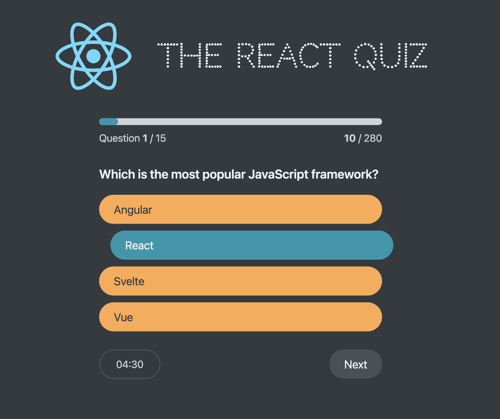

# React Quizz Web App

Fun little React Quizz that tests your knowledge with 15 questions about React concepts. Built to highlight the usage of the `useReducer` React hook.

Project based on [The Ultimate React Course 2023](https://www.udemy.com/course/the-ultimate-react-course/) by Jonas Schmedtmann.

## Getting Started

Run `npm install` or `bun install` to install all needed dependencies.

```bash
$ npm install
```

The API is simulated by a JSON file in the data folder running on `json-server`. You can change the port on the `package.json` file by changing the `--port` flag value.

```bash
$ npm run server

# on another terminal instance
$ npm run start
```

## Screenshots


